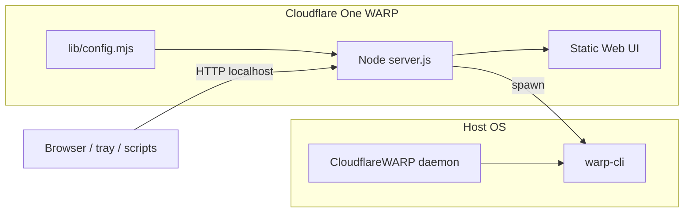

# Architecture

## Problem

Cloudflare ships a full **Cloudflare One** desktop client on Windows. Other platforms expose **`warp-cli`** and background daemons but no equivalent GUI. Cloudflare One WARP reimplements that control surface as a local HTTP API + optional Web UI, targeting **functional parity** and **drop-in compatibility** with existing WARP installs.

## High-level diagram



## Components

| Path | Role |
|------|------|
| `server.js` | HTTP server, `/api/*`, guarded `warp-cli` execution |
| `lib/config.mjs` | Layered configuration merge + session overrides |
| `public/` | Web UI (PWA-capable), optional when `webui.enabled=false` |
| `bin/cloudflare-one-warp` | Launcher: selected desktop app (Cloudflare One Client by default), daemon lifecycle |
| `bin/cloudflare-one-warp-tray` | Starts the selected shell; `--force-cloudflare-one-warp` for a session-only PyQt6/SNI/yad swap; `--settings` for native prefs |
| `scripts/tray-qt.py` | Embedded WebEngine window + Cloudflare One WARP system tray |
| `scripts/cloudflare-one-warp-nft-apply` | Polkit-scoped privileged helper for kill-switch nft apply |
| `lib/tray/autostart.mjs` | Cloudflare One WARP tray XDG autostart (`tray.autostart`) |
| `lib/tray/shell.mjs` | Desktop-shell detection, Cloudflare One Client autostart override, `warp-desktop-svc` unit management, live start/stop |
| `lib/warp/status.mjs` | Shared `warp-cli` status parsing |
| `lib/notify/` | Desktop notifications (`notify-send`) + status watcher |
| `scripts/health-check.mjs` | Used by launcher and CI to verify `/api/health` |

## Desktop notifications

When `ui.notifications` is true (default), `server.js` starts `lib/notify/status-watcher.mjs` on listen — independent of the Web UI or SSE clients. The watcher subscribes to a **single shared** `warp-cli --listen status` child (`lib/warp/status-listener.mjs`) alongside `/api/events` SSE clients, so reconnecting the UI does not spawn a new listener per tab. The watcher calls `notify-send` (libnotify) only on meaningful transitions (connect / disconnect / daemon lost / unhealthy), debounced ~1.5s. Requires `notify-send` on `PATH`; disable with `ui.notifications: false` or `CLOUDFLARE_ONE_WARP_DISABLE_NOTIFICATIONS=1`.

## API surface

| Route | Method | Purpose |
|-------|--------|---------|
| `/api/session` | GET | Local session credential for this daemon (same-origin loopback callers only) |
| `/api/health` | GET | Liveness; returns `app: "cloudflare-one-warp"` |
| `/api/readiness` | GET | Shared readiness truth (hard blockers vs soft warnings) for tray, Web UI, and launcher |
| `/api/diagnostics` | GET | Clipboard-ready diagnostics summary (no account secrets) |
| `/api/version` | GET | Installed version + update channel/source |
| `/api/version` | GET | Installed semver, channel, update source |
| `/api/config` | GET | Effective config + source flags |
| `/api/config/session` | POST | Provisional in-app overrides |
| `/api/account` | GET | Structured registration / account DTO |
| `/api/snapshot` | GET | Aggregated `warp-cli` command output |
| `/api/logs` | GET | In-memory ring buffer of recent `warp-cli` invocations (Console tab) |
| `/api/events` | GET | SSE stream from `warp-cli --listen status` |
| `/api/action` | POST | Whitelisted mutations (`connect`, `setMode`, …) |
| `/api/config/tray-autostart` | POST | Persist Cloudflare One WARP tray XDG autostart (Linux; ignored at login when `tray.shell` is `cloudflare`) |
| `/api/config/tray-shell` | POST | Persist desktop app: `cloudflare` or `cloudflare-one-warp` (Linux) |
| `/api/config/webui` | POST | Persist `webui.enabled` / `allowRemote` (restart required) |
| `/api/config/server` | POST | Persist `server.port` / `bind` (restart required) |
| `/api/config/ui` | POST | Persist `ui.notifications` |
| `/api/killswitch` | GET/POST | nftables kill-switch desired/active (Linux) |
| `/api/killswitch/enrollment-pause` | POST | Pause/resume KS around Zero Trust enrollment |
| `/api/update/check` | GET | Channel/manifest/GitHub update check |
| `/api/update/forks` | GET | Allowed update sources |
| `/api/update/releases` | GET | Release list for owner/repo |
| `/api/update/source` | POST | Session override for update source |
| `/api/update/prepare` | POST | Download/verify prepare token |
| `/api/update/apply` | POST | Apply prepared AppImage update |

Contract file: [`openapi/cloudflare-one-warp-api.json`](../openapi/cloudflare-one-warp-api.json). Secrets in command output are redacted before JSON serialization.

## Request gate

The daemon listens on loopback, so any web page a user visits can reach it. [`lib/http/request-gate.mjs`](../lib/http/request-gate.mjs) runs before routing — in both API-only and Full UI mode — and refuses anything that is not a local Cloudflare One WARP client:

| Check | Applies to | Failure |
|-------|-----------|---------|
| `Host` must be this daemon's loopback address and port | all requests | `403 host_not_allowed` (DNS rebinding) |
| Peer must be loopback | mutations, `/api/session` | `403 remote_peer_denied` |
| `Sec-Fetch-Site` must be `same-origin`/`none` | mutations, `/api/session` | `403 cross_site_denied` |
| `Origin` (or `Referer` when absent) must match this daemon | mutations, `/api/session` | `403 cross_origin_denied` |
| `Content-Type: application/json` | mutations | `415 json_required` |
| `X-Cloudflare-One-Warp-Session` must match the current credential | mutations | `403 session_required` |

Mutations are `POST`/`PUT`/`PATCH`/`DELETE` under `/api/`. Read-only requests stay open so `allowRemote` diagnostics keep working, but they can never change WARP or config state. Blocked requests are appended to the command log with source `security` — reason only, never the body or credential.

The credential is 32 random bytes minted at daemon start and written to `~/.config/cloudflare-one-warp/session-<port>.token` with mode `0600` (removed on shutdown). The Web UI fetches it from `GET /api/session` via [`public/api-client.js`](../public/api-client.js); the tray and native settings dialog read the file (falling back to the endpoint) via `scripts/tray_api.py`. It authenticates *the local user's clients*, not a person — it replaces nothing about `warp-cli` permissions.

API responses send `X-Content-Type-Options: nosniff`, `X-Frame-Options: DENY`, `Referrer-Policy: no-referrer`, and `Content-Security-Policy: default-src 'none'`; Web UI assets get a `'self'`-scoped policy that also allows the `qrc:` WebChannel bridge used by the tray shell.

## Always On (Linux)

Windows Cloudflare One exposes **Always On** in the client. Linux `warp-cli` has no public equivalent. Cloudflare One WARP implements **Always On (kill switch)** via nftables table `inet cloudflare_one_warp_killswitch`:

1. User toggles desired state → `POST /api/killswitch`
2. `lib/killswitch/apply.mjs` writes a validated rules script and runs `pkexec cloudflare-one-warp-nft-apply apply <file>` (or unprivileged `nft -f` when permitted)
3. Polkit policy `com.cloudflare.one.warp.nft-apply` scopes elevation to `/usr/lib/cloudflare-one-warp/scripts/cloudflare-one-warp-nft-apply`
4. GET `/api/killswitch` probes with read-only `nft list` — never escalates privilege
5. Zero Trust enrollment can pause rules via `lib/killswitch/enroll-pause.mjs` without clearing persisted desired state

## Configuration flow

1. **Boot** — `reloadConfig()` merges layers (see [CONFIGURATION.md](CONFIGURATION.md)).
2. **Listen** — `effectiveBind()` returns `127.0.0.1` unless `webui.enabled && webui.allowRemote`.
3. **Runtime** — Session overrides mutate an in-memory layer; GET `/api/config` reflects changes immediately for keys that do not require restart.
4. **WARP** — `warp.cli` selects binary; Flatpak sets `FLATPAK_ID` and uses `flatpak-spawn --host`.

## Platform matrix

| Platform | Daemon | Web UI | WARP CLI |
|----------|--------|--------|----------|
| Linux native | systemd user service or launcher | Optional | Host `warp-cli` |
| Linux Flatpak | same | Optional | `flatpak-spawn --host warp-cli` |
| Linux Snap (classic) | same | Optional | Host `warp-cli` |
| macOS Homebrew | manual / future launchd | Optional | Homebrew + Cloudflare WARP |
| Container (GHCR) | `node server.js` | Off by default | Mount host binary |

## Security model (v1)

- Binds to loopback unless explicitly configured for remote Web UI.
- No shell when invoking `warp-cli`; argument allow-lists for `/api/action`.
- Destructive operations require GUI confirmation.
- Every mutation passes the [request gate](#request-gate): local Host, loopback peer, same-origin, JSON body, and the per-daemon session credential. A page the user visits cannot drive WARP, and a remote peer cannot mutate anything even when `webui.allowRemote` or a `0.0.0.0` bind is configured.
- **Cross-site guard:** inside the API handler, every non-GET request also passes `crossSiteRejection()` — `Sec-Fetch-Site`, `Origin`, and a required `application/json` content type — as a second check behind the request gate.
- AppImage self-updates require a valid Ed25519 signature from a pinned key and refuse downgrades (see [UPDATES.md](UPDATES.md)).
- **Gap:** the kill-switch helper still elevates through `pkexec`, so the systemd units cannot set `NoNewPrivileges=true` yet (see [PACKAGING.md](PACKAGING.md)).

## Packaging layout (FHS)

```
/usr/bin/cloudflare-one-warp
/usr/bin/cloudflare-one-warp
/usr/bin/cloudflare-one-warp-tray
/usr/lib/cloudflare-one-warp/server.js
/usr/lib/cloudflare-one-warp/scripts/tray-qt.py
/usr/lib/cloudflare-one-warp/scripts/cloudflare-one-warp-nft-apply
/usr/share/polkit-1/actions/com.cloudflare.one.warp.policy
/usr/lib/cloudflare-one-warp/public/
/etc/default/cloudflare-one-warp
/etc/cloudflare-one-warp/config.json.example
/usr/lib/systemd/user/cloudflare-one-warp.service
```

## Testing

- `npm run check` — syntax
- `npm run test:all` — Plane M (mock CLI, OpenAPI shapes, units)
- `npm run test:ui` — Playwright against mock daemon
- `npm run test:warp:real` — Plane R (optional Linux)
- CI package smoke — deb/rpm on Ubuntu

See [CI.md](CI.md) for confidence levels and [PACKAGING.md](PACKAGING.md) for release mechanics.

## Parity strategy

Cloudflare One WARP maps Windows Cloudflare One workflows to `warp-cli` surfaces in the Web UI (expert mode) and a simplified native shell (Connectivity, Profile, etc.). New surfaces should:

1. Add read commands to `COMMANDS` in `server.js`.
2. Add guarded actions to `ACTIONS` / `actionArgs`.
3. Extend `public/app.js` views.
4. Document behavior in CHANGELOG.

Native PyQt6 shell embeds the same HTTP API (`/?shell=1` simple layout, expert toggle). Tauri/Electron remain optional follow-ups.
